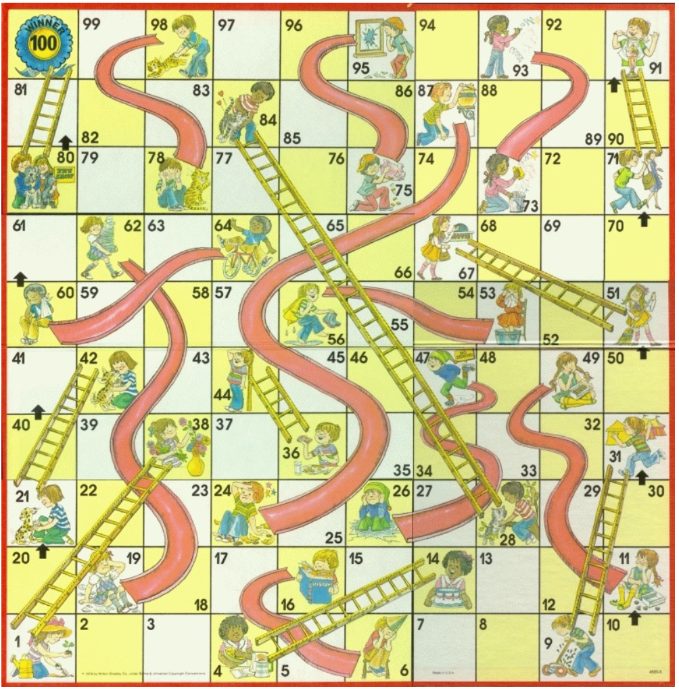

# Solve Chutes and Ladders with Reinforcement Learning and Dynamic Programming

This project is one of our course works where we used Monte Carlo, Q-learning, SARSA, and Dynamic programming to solve Chutes and Ladders game. We implemented 4 algorithms to caclucalte the average optimal number of steps to reach to the final goals of the game board. 

The project solves this version of Chutes and Ladders:

The die in this game are Effron Dice (which are probabilistically intransitive). Below are the four die choices along with the values on their faces.  

RED:  2, 2, 2, 2, 6, 6
BLUE: 3, 3, 3, 3, 3, 3
GREEN: 1, 1, 1, 5, 5, 5
BLACK: 0, 0, 4, 4, 4, 4

To solve the game, we want to compute three things:

Policy: the optimal decision for each state of the game as to which dice to select.   The policy will map states to dice choices.
Value V(s):  this is the value of being in state s -- the sum of future rewards when starting in state s. This will be the negative value of the average number of moves it will take a player to reach the goal from that state s.  
Value Q(s,a):  Same as V(s) except we also specify one of the dice color choices as an action.  

As part of this assignments, we created a `.pdf` file to explain the key concepts of these 4 approaches which reflects our understanding on Dynamic Programming and Reinforcement Learning. 
Please visit the pdf file [Chutes and ladders](https://drive.google.com/file/d/1NhrtRMeoA1fY39mlwyYiZO9-nQLTf_Dx/view?usp=sharing 'here'). 

